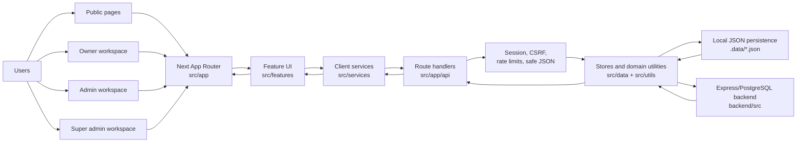
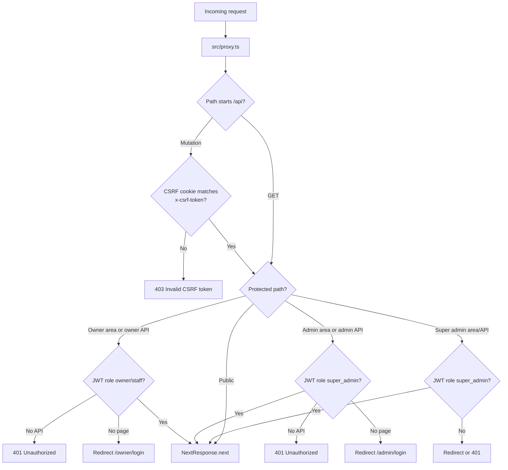
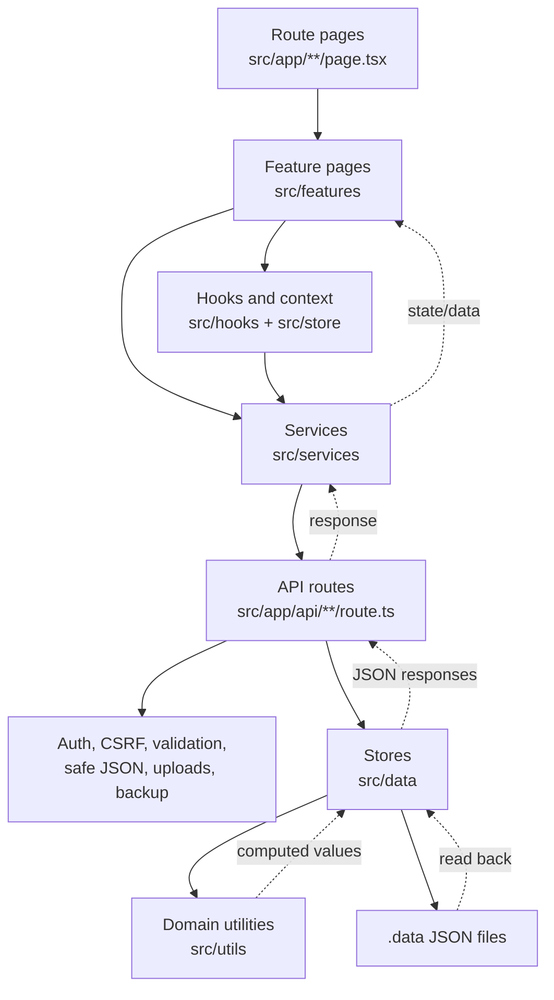

# Tenant Management System Whiteboard

This board shows how the main parts of the app are linked and which direction data moves through the system.

## Big Picture



## App Shell And Routing

Next.js exposes routes from `src/app`. A `page.tsx` file makes a URL visible, a `layout.tsx` wraps child routes, and a `route.ts` file creates an API endpoint.

```mermaid
flowchart TD
  Root[src/app/layout.tsx\nTheme + Query + Toast providers] --> PublicHome[/\nsrc/app/page.tsx]
  Root --> OwnerLayout[src/app/owner/layout.tsx\nOwnerShell]
  Root --> AdminProtected[src/app/admin/(protected)/layout.tsx\nAdminShell]
  Root --> SuperProtected[src/app/super-admin/(protected)/layout.tsx]
  Root --> ApiRoot[/api/*\nroute handlers]

  OwnerLayout --> OwnerPublic[/owner/login, /owner/signup,\n/owner/accept-invite]
  OwnerLayout --> OwnerPrivate[/owner/dashboard, rooms,\ntenants, payments, billing,\nreports, settings, backup]

  OwnerLayout --> OwnerShell[OwnerShell]
  OwnerShell --> HostelContext[HostelContextProvider]
  OwnerShell --> OwnerSidebar[OwnerSidebar]
  OwnerShell --> OwnerTopbar[OwnerTopbar]
  OwnerShell --> OwnerMobileNav[OwnerMobileNav]

  AdminProtected --> AdminPages[/admin/dashboard, hostels,\nbilling, analytics, backups, settings]
  SuperProtected --> SuperPages[/super-admin/dashboard,\naccess-management]
```

## Request Protection

`src/proxy.ts` runs before matched owner, admin, super-admin, and API routes.



## Owner Workspace Flow

```mermaid
flowchart LR
  OwnerLogin[/owner/login] --> AuthApi[/api/auth/owner/login]
  AuthApi --> JwtCookie[JWT access cookie]
  JwtCookie --> OwnerShell

  OwnerShell --> HostelContext
  HostelContext --> FetchHostels[fetchOwnerHostels]
  FetchHostels --> OwnerHostelsApi[/api/owner-hostels]
  OwnerHostelsApi --> OwnerHostelStore[src/data/ownerHostelStore.ts]
  OwnerHostelStore --> HostelsJson[.data/hostels.json]

  OwnerShell --> Dashboard[/owner/dashboard]
  OwnerShell --> Rooms[/owner/rooms]
  OwnerShell --> Tenants[/owner/tenants]
  OwnerShell --> Payments[/owner/payments]
  OwnerShell --> Billing[/owner/billing]

  Dashboard --> UseOwnerTenants[useOwnerTenants]
  Rooms --> UseOwnerTenants
  Tenants --> TenantsService[src/services/tenants]
  Payments --> TenantsService
  UseOwnerTenants --> TenantsApi[/api/tenants]
  TenantsService --> TenantsApi
  TenantsApi --> TenantStore[src/data/tenantStore.ts]
  TenantStore --> TenantsJson[.data/tenants.json]

  Billing --> OwnerBillingService[src/services/owner/owner-billing.service.ts]
  OwnerBillingService --> OwnerBillingApi[/api/owner-billing]
  OwnerBillingApi --> AdminStore[src/data/adminStore.ts]
  AdminStore --> AdminJson[.data/admin-control.json]
```

## Tenant Lifecycle

```mermaid
flowchart TD
  Start[Owner opens Tenants page] --> Add[Add tenant form]
  Add --> CreateApi[POST /api/tenants]
  CreateApi --> Validate[Validate input and session]
  Validate --> CreateStore[createTenantRecord]
  CreateStore --> PersistTenant[Persist tenant in .data/tenants.json]

  PersistTenant --> Assign{Room/bed selected?}
  Assign -->|Yes| AssignApi[POST /api/tenants/assign-room]
  AssignApi --> Inventory[getOwnerHostelInventory]
  Inventory --> BedRules[Check unit/bed availability]
  BedRules --> SaveAssignment[assignTenantRoom]
  Assign -->|No| TenantList[Refresh tenant list]
  SaveAssignment --> TenantList

  TenantList --> Payment[Collect rent]
  Payment --> PayApi[POST /api/tenants/pay-rent]
  PayApi --> RecordPayment[recordTenantPayment]
  RecordPayment --> DueDate[calculateNextDueDate]
  DueDate --> PaymentHistory[Update paymentHistory]
  PaymentHistory --> PersistTenant

  TenantList --> Profile[Complete or edit profile]
  Profile --> PatchApi[PATCH /api/tenants/[id]]
  PatchApi --> UpdateProfile[updateTenantProfile]
  UpdateProfile --> PersistTenant

  TenantList --> Remove[Remove tenant]
  Remove --> DeleteApi[DELETE /api/tenants/remove]
  DeleteApi --> RemoveStore[removeTenantRecord]
  RemoveStore --> PersistTenant
```

## Billing And Admin Control

```mermaid
flowchart LR
  AdminUser[Admin / Super admin] --> AdminPages
  AdminPages --> AdminApi[/api/admin/* and /api/super-admin/*]
  AdminApi --> AdminStore

  AdminStore --> Hostels[getOwnerHostels]
  AdminStore --> Tenants[getTenantRecords]
  Hostels --> BillingCalc[calculateBilling]
  Tenants --> BillingCalc

  BillingCalc --> Invoice[generateInvoice]
  Invoice --> AdminJson[.data/admin-control.json]

  OwnerBilling[/owner/billing] --> OwnerBillingApi[/api/owner-billing]
  OwnerBillingApi --> OwnerInvoice[getOwnerBilling]
  OwnerInvoice --> Invoice

  OwnerBilling --> Pay[Pay / submit proof / request upgrade]
  Pay --> OwnerBillingMutations[/api/owner-billing/pay\n/api/owner-billing/request-upgrade]
  OwnerBillingMutations --> AdminStore

  AdminPages --> Review[Review proofs, plans,\nfeatures, owner access]
  Review --> AdminStore
```

## Data Ownership

| Area | Main UI | Service/API | Store | Persistence |
| --- | --- | --- | --- | --- |
| Hostels and rooms | `src/features/owner/*`, `OwnerShell`, hostel switcher | `/api/owner-hostel`, `/api/owner-hostels` | `src/data/ownerHostelStore.ts` | `.data/hostels.json` |
| Tenants, assignments, payments | `src/features/tenants/*`, `src/features/payments/*` | `/api/tenants/*` | `src/data/tenantStore.ts` | `.data/tenants.json` |
| Billing, invoices, feature flags, admin controls | `src/features/admin/*`, `src/features/owner/billing/*` | `/api/admin/*`, `/api/owner-billing/*` | `src/data/adminStore.ts` | `.data/admin-control.json` |
| Auth/session | login pages and auth services | `/api/auth/*`, `/api/super-admin/login`, `src/proxy.ts` | `src/lib/auth.ts`, `src/lib/session-mode.ts`, `src/data/ownersStore.ts` | JWT cookie, backend owner data, in-memory lockout map |
| Uploads and backups | tenant document/proof flows, owner backup page | `/api/uploads/*`, `/api/owner/backup/*` | `src/lib/document-upload.ts`, `src/lib/payment-proof-upload.ts`, `src/lib/backup.ts` | local upload/backup files where available |

## Directional Rules



Keep new code flowing in this direction when possible:

1. `src/app` should stay mostly as route wiring.
2. UI behavior belongs in `src/features`, shared shells/components, hooks, and context.
3. Browser calls should go through `src/services` or a dedicated hook.
4. Server writes should go through `src/app/api/**/route.ts`, then stores/utilities.
5. Local persistence should stay centralized in `src/data` or `src/lib`, not scattered through UI components.
